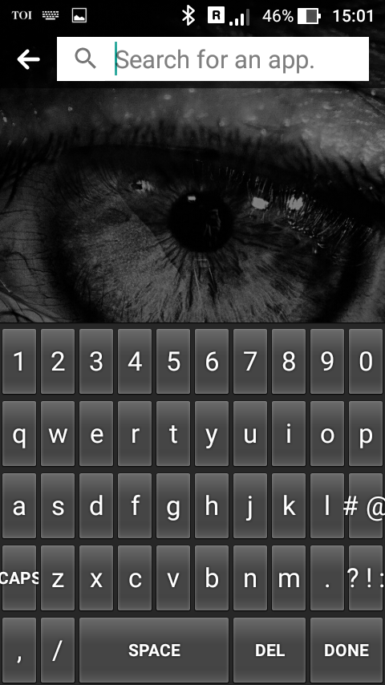

# Project Name
Lazy Keyboard (Android Application)

# Details
This is my first simple and basic application for android.
Click here for [download](LazyKeyboard.apk) this application.

# Output

# Software Required
* Android Studio

# Import Project
* Unzip this project and place the unziped folder in **AndroidStudioProject** folder.
* Open Android studio
* Then goto the **file** menu and click **open**
* Open the project from **AndroidStudioProject**

# Run The Code
You can run the android project by two method :
* by running the emmulator
* on your android device
Just click on the **RUN** button present in the run menu in the android studio and you are ready to go.
